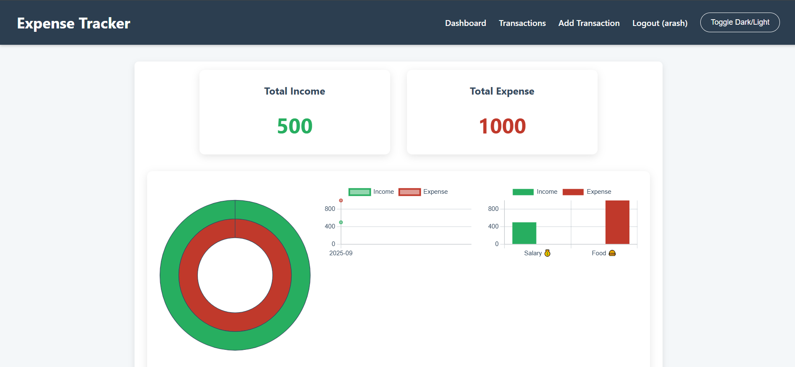

A simple and efficient personal finance management system built with the Flask framework and SQLite database. This tool helps you easily track, analyze and manage your income and expenses.

## ✨ Features

* **Transaction Management**: Easily add, edit and delete transactions (income and expenses).
* **Interactive Dashboard**: Visually display your financial status through bar, line and pie charts.
* **Financial Summary**: Display your total income and expenses at a glance.
* **Search and Sort**: Filter and sort transactions by type, category, amount and date.
* **Get Output**: Ability to receive reports in CSV and Excel files.
* **Attractive UI**: Modern and responsive design with support for light and dark modes.
* **Authentication**: Secure login and registration system for users.

---

## 🚀 Installation and Setup

To run the project on your system, follow these steps:

1. **Clone the codebase:**
    ```bash
    git clone https://github.com/Good-Wizard/Expense-Tracker.git
    ```

3. **Install the required libraries:**
    ```bash
    pip install -r requirements.txt
    ```
